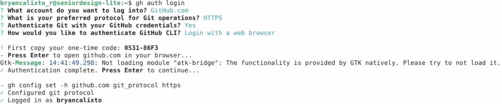

# Google Cloud VM and CARLA setup

## Table of Contents
1. Introduction
2. VM Configuration & Connect via SSH
3. Install Chrome Remote Desktop (CRD)
4. Install NVIDIA Drivers, CARLA, and other required software
5. Start CRD, Log into GitHub, Setup CARLA
6. Run CARLA Server and Player

## 1. Introduction

This is a guide on how to run CARLA Simulator on a Google Cloud Virtual Machine (VM). 

This guide does NOT cover how to setup a Google Cloud account. Cloud fees may apply. As of October 2025, Google Cloud is offering a 90-day, $300 free trial. Learn more here: https://cloud.google.com/free/docs/free-cloud-features.

## 2. VM Configuration & Connect via SSH

After setting up a Google Cloud account with funds, create a compute VM instance.

1. Start from the Google Cloud Console (homepage)
2. Go to the navigation menu
3. Under "Compute Engine", click on "VM Instances"
4. Click on "Create instance" to start the VM configuration

### VM Configuration

Configure the VM. Any configuration not listed will be left in the default setting.

1. Machine Configuration
    * Name: ```seniordesign-heavy```
    * Region: ```us-east1 (South Carolina)```
    * Machine Type: ```g2-standard-32 (32 vCPU, 16 core, 128GB memory) [GPU Preset]``` *

2. OS and Storage
    * OS: ```Ubuntu```
    * Version: ```Ubuntu 22.04 LTS for x86``` **
    * Disk Size: ```256GB``` ***

3. Networking
    * ```Allow HTTP```
    * ```Allow HTTPS```

4. Security
    * ```Allow full access to all Cloud APIs```

### Connecting to the VM via SSH

In the VM Instances menu, connect to SSH via "SSH" under "Connect". Authorize SSH access via browser.

**NOTES**

A **cloud quota** is the limit set on how much of a cloud resource you’re allowed to use (like storage, CPU, or bandwidth).

Before requesting quota increase, first select the desired configuration. Quota should be requested when prompted to take action on a quota issue. Per previous experience, exact quota request is recommended instead of estimated future quota needs. Requesting excess resources will likely be result in a declined request (e.g. requesting 4 GPUs when only 2 are needed).

\* This guide uses 32 vCPU, which is more than enough compute. An 8 vCPU, 32GB RAM instance should suffice.

\*\* LTS = Long-term support

\*\*\* CARLA 20GB + UnReal Engine 130GB + Misc.

## 3. Install Chrome Remote Desktop (CRD)

The following instructions are based on the official Google Cloud guide (https://cloud.google.com/architecture/chrome-desktop-remote-on-compute-engine)

### Install CRD and install a desktop environment. 
This setup will install the lightweight ```Xcfe``` desktop environment. Read more about Xcfe here: https://www.xfce.org/

```
curl https://dl.google.com/linux/linux_signing_key.pub \
    | sudo gpg --dearmor -o /etc/apt/trusted.gpg.d/chrome-remote-desktop.gpg
echo "deb [arch=amd64] https://dl.google.com/linux/chrome-remote-desktop/deb stable main" \
    | sudo tee /etc/apt/sources.list.d/chrome-remote-desktop.list
sudo apt-get update
sudo DEBIAN_FRONTEND=noninteractive \
    apt-get install --assume-yes chrome-remote-desktop

sudo DEBIAN_FRONTEND=noninteractive \
    apt install --assume-yes xfce4 desktop-base dbus-x11 xscreensaver
sudo bash -c 'echo "exec /etc/X11/Xsession /usr/bin/xfce4-session" > /etc/chrome-remote-desktop-session'
sudo systemctl disable lightdm.service
sudo apt install --assume-yes task-xfce-desktop
```

**Note**: The command ```sudo systemctl disable lightdm.service``` may return an error, like ```Failed to disable unit: Unit file lightdm.service does not exist.```. This is because [explain]. Ignore the error.

### Configure and start CRD. 

Go to https://remotedesktop.google.com/headless.
1. Click Begin > Next > Authorize.
2. Copy the command under "Debian Linux". It should look like the example below.


3. Run the command in the VM
4. Create a pin for CRD. *Do not lose this pin*.
5. Verify with ```sudo systemctl status chrome-remote-desktop@$USER```. The output should include ```Active: active (running)```. Use ```Ctrl + C``` to exit.
6. Go to ```https://remotedesktop.google.com/access``` and refresh. The VM is now accessible via CRD.

### Optional
Optionally install Chrome (really, it's optional)
```
curl -L -o google-chrome-stable_current_amd64.deb \
https://dl.google.com/linux/direct/google-chrome-stable_current_amd64.deb
sudo apt install --assume-yes --fix-broken ./google-chrome-stable_current_amd64.deb
```

## 4. Install NVIDIA Drivers, CARLA, and other required software

NVIDIA drivers are not installed by default. They must be installed before using any NVIDIA GPU.

```
# Donwload python packages and GitHub CLI
sudo apt install python3-pip -y
sudo apt install python3-venv -y
sudo apt install python3-tk -y
sudo apt install gh

# Download CARLA and CARLA maps
wget -O CARLA_0.9.16.tar.gz https://tiny.carla.org/carla-0-9-16-linux
wget -O AdditionalMaps_0.9.16.tar.gz https://tiny.carla.org/additional-maps-0-9-16-linux

# Download NVIDIA drivers
sudo apt install ubuntu-drivers-common -y
sudo ubuntu-drivers autoinstall
sudo reboot  # System will reboot
```

This guide uses the ```ubuntu-drivers-common``` tool to automatically install required drivers. Once reboot is complete, the command ```nvidia-smi``` should now show GPU details.

## 5. Start CRD, Log into GitHub, Setup CARLA

### **Access the VM through Chrome Remote Desktop.** 
Commands beyond this point will be entered into the desktop terminal.

### Log into GitHub

Because the senior design library is private, GitHub credentials are needed.
```
gh auth login
```



### Clone Senior Design repo & setup CARLA

```
# From user directory, clone (private) senior design repository
cd
git clone https://github.com/julianrod04/HondaAI.git

# Move CARLA files to CARLA-sim folder, then extract
mv CARLA_0.9.16.tar.gz AdditionalMaps_0.9.16.tar.gz HondaAI/CARLA-sim/

cd HondaAI/CARLA-sim
tar -xvf CARLA_0.9.16.tar.gz
tar -xvf AdditionalMaps_0.9.16.tar.gz

# Create virtual environment for python
python3 -m venv .carla-venv
source .carla-venv/bin/activate
python3 -m pip install numpy pandas matplotlib pygame carla

# Setup CARLA maps & control
./ImportAssets.sh
sed -i 's/^bUseMouseForTouch=False$/bUseMouseForTouch=True/' CarlaUE4/Config/DefaultInput.ini
```

Note: CARLA does not correctly handle mouse free-look by default, which is why ```bUseMouseForTouch``` is updated.

## 6. Run CARLA Server and Player

**For each terminal, ensure current directory is CARLA root folder (~/CARLA-sim) and activate the virtual environment (```source .carla-venv/bin/activate```)**


**Terminal Tab 1**

```
./CarlaUE4.sh
```

This will start the server and open the server-view window.

**Terminal Tab 2**

```
./PythonAPI/util/config.py --map Town06
python3 PythonAPI/examples/manual_control.py
```

This will change the server-view to map Town06, and open the user-controlled car game mode.

### Notes

CARLA Official Repo: https://github.com/carla-simulator/carla

CARLA Installation and Setup: https://www.youtube.com/watch?v=tV6iO8JikTw

Server mouse sentitivity issue: https://github.com/carla-simulator/carla/issues/3579